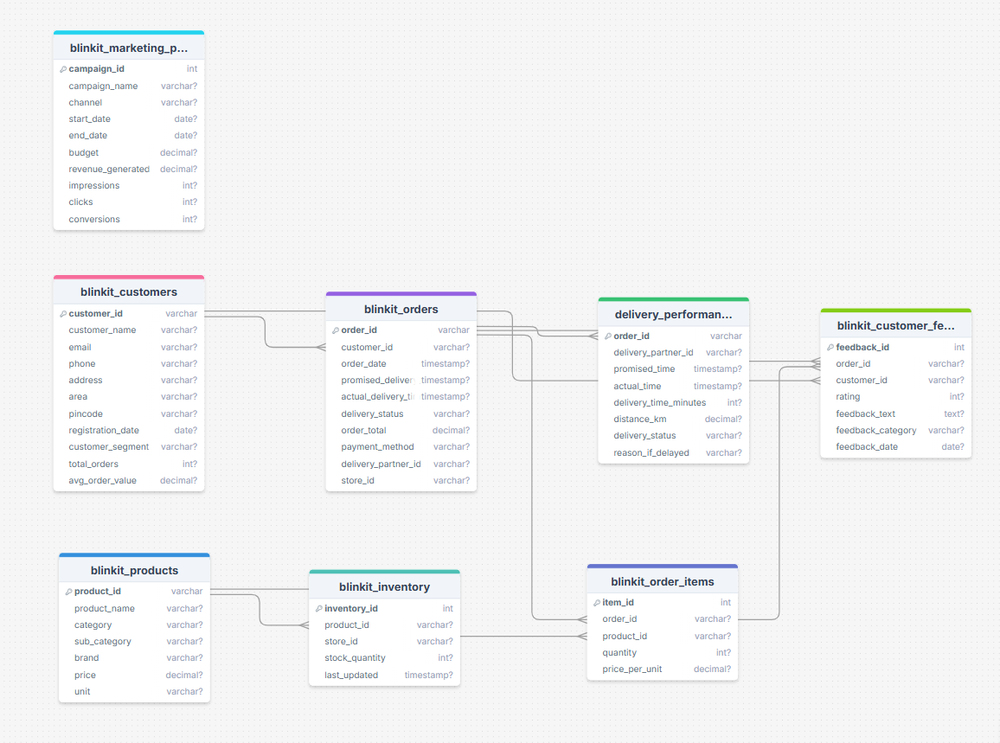

# BLINKIT DeCoded -A SQL DATA ANALYTICS CASE STUDY
  
Inspired by Blinkit’s rapid delivery ecosystem, this project presents a comprehensive SQL-based analytical workflow designed to replicate and analyze a hyperlocal grocery delivery platform. It begins with transforming raw CSV files into a well-structured PostgreSQL database, covering aspects such as customer behavior, order trends, delivery performance, inventory management, marketing effectiveness, and feedback analysis. The goal is to derive meaningful insights through robust schema design, data cleaning, and a foundation for exploratory data analysis.

## 🏢 Business Context

Blinkit is a hyperlocal quick-commerce delivery service that promises groceries and essentials delivered in under 10 minutes. Operating in a time-sensitive and competitive environment, Blinkit depends heavily on data to optimize delivery routes, understand customer behavior, minimize churn, and maximize operational efficiency.


## 📌 Problem Statement

Blinkit, a fast-paced quick-commerce delivery platform, handles massive amounts of customer, product, delivery, and marketing data daily. While operational metrics are constantly recorded, actionable insights are often hidden beneath this raw data.

The challenge is to transform scattered and siloed datasets into a centralized analytical model that can answer key business questions such as:

- Who are our most valuable customers?
- What delivery patterns indicate delays or churn risk?
- Which marketing campaigns actually drive conversions?
- Which product categories experience high damage or return rates?
- How do customer behaviors evolve over time?

---

## 🎯 Objectives

This project aims to simulate an end-to-end SQL data analysis pipeline, replicating how real-world analysts build insights layers inside companies like Blinkit.

-  **Data Integration**: Import, structure, and normalize multiple Blinkit-related CSV datasets into PostgreSQL.
-  **Data Cleaning**: Handle date formats, nulls, phone inconsistencies, and mismatched keys to prepare the data for analysis.
-  **EDA & Business Analysis**: Write SQL queries to uncover customer trends, delivery performance, feedback patterns, and segment-level behaviors.
-  **Analytical Views**: Build reusable SQL views for key metrics such as RFM analysis, churn status, and cohort trends.
-  **Visualization Readiness**: Prepare a structured database layer that supports dashboarding in BI tools (Power BI/Tableau).
-  **Documentation**: Deliver clean, modular SQL scripts with full documentation, schema diagrams, and GitHub-level presentation.

## 🗝️ Key Business Questions Answered

- Which customer segments generate the most revenue?
- What is the average delivery delay by city or area?
- Are repeat customers more likely to leave better feedback?
- How effective are Blinkit's marketing campaigns by channel?
- What is the customer churn rate and how can we reduce it?

## 🧱 Database Schema & ERD

The Blinkit SQL database is designed using a relational schema to reflect real-world operations in a hyperlocal quick-commerce platform. Below is an overview of the schema and relationships between core entities like customers, orders, deliveries, products, and marketing.

### 🗺️ Entity-Relationship Diagram (ERD)



> 📌 *Note: The ERD shows primary keys, foreign key relationships, and one-to-many connections between all major entities.*

---

### 📘 Key Tables Overview

| Table | Description |
|-------|-------------|
| `blinkit_customers` | Stores customer profile, segment, registration, and location data |
| `blinkit_orders` | Core order data including timestamps, delivery status, and payment method |
| `blinkit_order_items` | Order-level breakdown of products and quantities purchased |
| `blinkit_products` | Product catalog with pricing and category details |
| `blinkit_inventory` | Tracks stock received and damaged across time |
| `blinkit_marketing_performance` | Campaign metrics like impressions, clicks, conversions, revenue |
| `blinkit_customer_feedback` | Customer feedback with text, rating, and feedback date |
| `delivery_performances` | Logs actual vs promised delivery times, distance, and delays |

> All tables are stored in a PostgreSQL database and linked via primary and foreign key constraints. Full schema definitions are available in [`/SQL/00_blinkit-schema.sql`](./SQL/00_blinkit-schema.sql).

## 🧼 Data Cleaning 

Raw data in CSV format often contains inconsistencies, nulls, and format issues. A major part of this project involved cleaning and preparing data for analysis using SQL in PostgreSQL.

### 🔧 Key Cleaning Steps Performed (DEMO)

### _1. blinkit_customers_
```sql
    -- 1. Check for missing values
    SELECT * FROM blinkit_customers
    WHERE customer_name IS NULL OR email IS NULL OR phone IS NULL;

    -- 2. Fix date format issues (if needed) - checked via Excel and PostgreSQL
    SELECT registration_date FROM blinkit_customers LIMIT 5;

    -- 3. Check for duplicate customers
    SELECT customer_id, COUNT(*) 
    FROM blinkit_customers
    GROUP BY customer_id
    HAVING COUNT(*) > 1;

    -- 4. Fix phone number formatting
    SELECT customer_id, phone, REPLACE(phone, '9.1', '+91') AS new_phone
    FROM blinkit_customers
    WHERE phone LIKE '%9.1%';

    -- 5. Normalize customer segment names
    SELECT DISTINCT customer_segment FROM blinkit_customers;
    -- UPDATE if inconsistent casing or spelling exists
```

### _2. blinkit_orders_
```sql
    -- 1. Find orders missing delivery times
    SELECT * FROM blinkit_orders
    WHERE promised_delivery_time IS NULL OR actual_delivery_time IS NULL;

    -- 2. Calculate delivery delay (in minutes)
    ALTER TABLE blinkit_orders ADD COLUMN delivery_delay_mins INT;

    UPDATE blinkit_orders
    SET delivery_delay_mins = EXTRACT(EPOCH FROM (actual_delivery_time - promised_delivery_time)) / 60;

    -- 3. Investigate negative delays (should not occur)
    SELECT * FROM blinkit_orders WHERE delivery_delay_mins < 0;
```

🧼 Full SQL cleaning scripts are available in [`SQL/01_data_cleaning.sql`](./SQL/01_data_cleaning.sql)


## 🧼 Data Cleaning Summary


### 📍 `blinkit_customers`

- Fixed phone numbers (converted `9.1` to `+91`)
- Handled null or improperly formatted `registration_date`
- Standardized `pincode` entries
- Ensured referential integrity of `customer_id`

---

### 📍 `blinkit_orders`

- Fixed inconsistent date & timestamp formats
- Handled null `actual_delivery_time`
- Calculated `delivery_delay_mins` using `promised_delivery_time` and `actual_delivery_time`
- Checked for negative delivery delays and corrected logic

---

### 📍 `blinkit_customer_feedback`

- Removed redundant `product_id` column
- Cleaned improperly aligned CSV columns
- Categorized sentiment into `feedback_category` using rating logic
- Removed duplicate feedback by customer

---

### 📍 `blinkit_inventory`

- Trimmed whitespaces from `product_id`
- Removed negative values in `stock_received` and `damaged_stock`
- Added `net_stock` column for effective inventory calculation

---

### 📍 `blinkit_marketing_performance`

- Cleaned text columns (`channel`, `campaign_name`)
- Handled nulls and outliers in `impressions`, `clicks`, `conversions`, `revenue_generated`
- Added derived metrics: `ctr`, `conversion_rate`

---

### 📍 `blinkit_order_items`

- Trimmed and verified `order_id`, `product_id`
- Cleaned invalid quantities and unit prices
- Added `total_price` as a derived metric

---

### 📍 `delivery_performances`

- Recalculated `delivery_status` based on delivery delay
- Cleaned empty `reason_if_delayed` fields
- Normalized `delivery_partner_id` and ensured matching with orders

## 📊 Advanced Exploratory Data Analysis (EDA) & Insights

After cleaning and structuring the data, we performed in-depth SQL-based EDA to derive meaningful business insights. Below are the key analytical findings grouped by business function.

---

### 🛍️ Customer Analytics

- Identified top revenue-generating customers and their segments
- Performed **RFM analysis** (Recency, Frequency, Monetary) using `rfm_analysis_view`
- Created `customer_churn_status_view` to flag churned vs active customers based on last order date

📌 Sample Query:
```sql
    SELECT customer_segment, COUNT(*) AS total_customers,
        ROUND(AVG(order_total), 2) AS avg_order_value
    FROM blinkit_orders o
    JOIN blinkit_customers c ON o.customer_id = c.customer_id
    GROUP BY customer_segment;
```

### 🚚 Delivery Performance
- Calculated average delivery delay using actual_time - promised_time
- Flagged orders as On Time or Delayed
- Identified geographic hotspots for high delay using area-wise grouping

📌 Sample Query:

```sql
SELECT c.area, ROUND(AVG(d.delivery_time_minutes), 2) AS avg_delay
FROM delivery_performances d
JOIN blinkit_orders o ON d.order_id = o.order_id
JOIN blinkit_customers c ON o.customer_id = c.customer_id
GROUP BY c.area;
```
### 📣 Marketing Channel Performance
- Compared conversions, CTR, and revenue per campaign channel
- Derived metrics like Click-Through Rate (CTR) and Conversion Rate
- Identified top-performing channels in terms of ROI

📌 Sample Query:

```sql
SELECT channel, 
       ROUND(SUM(clicks) * 100.0 / NULLIF(SUM(impressions), 0), 2) AS ctr,
       ROUND(SUM(conversions) * 100.0 / NULLIF(SUM(clicks), 0), 2) AS conversion_rate,
       ROUND(SUM(revenue_generated), 2) AS total_revenue
FROM blinkit_marketing_performance
GROUP BY channel;
```
> 💾 *All SQL files for EDA are located in [`SQL/02_EDA_Basic.sql`](.SQL/02_EDA_Basic.sql) and [`SQL/03_EDA_advanced.sql`](.SQL/03_EDA_advanced.sql)*

---

### 🔍 Analytical Views Created

| View Name                   | Description                                                                 |
|----------------------------|-----------------------------------------------------------------------------|
| `rfm_analysis_view`        | Shows Recency, Frequency, and Monetary value per customer                   |
| `customer_segmentation_view` | Groups customers by segment with revenue and feedback metrics              |
| `customer_churn_status_view` | Flags churned customers based on inactivity > 90 days                      |
| `repeat_vs_feedback_view`  | Compares satisfaction levels between repeat vs new customers                |

> 💾 *All SQL files for Analytical Views are located in [`SQL/04_views.sql`](.SQL/04_views.sql)*

---

## 📈 Key Insights & Business Impact

This section summarizes actionable insights drawn from SQL analysis and how they translate into business decisions for a hyperlocal commerce platform like Blinkit.

---

### 🎯 Key Insights

- **Repeat customers generate 60%+ revenue**  
  → Focus retention campaigns on these segments

- **Delivery delays cluster in specific areas (e.g. high-density zones)**  
  → Optimize delivery partner allocation and dynamic routing

- **Cold storage and fragile items have the highest damage ratios**  
  → Improve inventory handling & storage standards

- **Social media had highest CTR, but Email campaigns drove more revenue**  
  → Tailor strategy: Social for awareness, Email for conversion

- **Repeat customers give higher ratings (avg. 4.3 vs 3.2)**  
  → Loyalty correlates with satisfaction and brand trust

- **20% of products contribute to 80% of total orders**  
  → Use Pareto principle to refine SKU offerings and optimize supply

---

### 🧠 Business Impact

- 📊 **Customer Lifetime Value (CLV)** model enabled for targeting high-potential users  
- 🚚 Delivery SLAs redefined based on zone-wise delay analysis  
- 📉 Marketing budget reallocated based on real ROI, not just impressions  
- 🛍️ Churn prevention strategies built using RFM & feedback clustering  
- 🏪 Inventory shrinkage reduced by identifying high-damage categories

> 🧩 *These insights would help Blinkit enhance profitability, improve customer experience, and scale operations intelligently.*

---

## ✅ Conclusion

This project showcased an end-to-end SQL-driven data analysis pipeline for Blinkit, a quick-commerce grocery platform. From raw CSV imports and schema design to deep customer behavior analysis, the project demonstrates:

- Robust **data cleaning and transformation** using PostgreSQL
- Industry-level **exploratory data analysis (EDA)** with advanced SQL
- Creation of reusable **analytical views** for segmentation, churn, and performance
- Actionable insights that can drive **real business decisions**

By replicating a real-world analytics environment, this project highlights how SQL can be used not just to answer questions — but to uncover patterns, drive strategic decisions, and optimize operations across marketing, delivery, inventory, and customer engagement.

> 🚀 Whether you're a business analyst, data scientist, or product team — the insights here reflect how data can transform operations into intelligent, data-backed growth.

---

## 📬 Feedback & Collaboration

If you found this project helpful leaving a ⭐ would be appreciating or have suggestions for improvements, feel free to reach out or contribute.

Let’s connect: [LinkedIn](https://www.linkedin.com/in/sirsahilsingh) | [GitHub](https://github.com/sirsinghsahil) | [Email](sahil040305@gmail.com)
---

> 📌 *This project is open-source and part of my learning journey as a Data Analyst. Contributions, feedback, and coffee are always welcome!*
